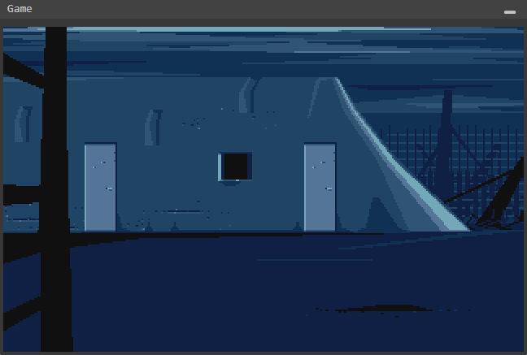

# Another World Suite

## Description

A Rust implementation of the "Another World" ("Out of This World" in the USA) game engine, compiled to WebAssembly to run it in the web. It also includes a debugger and a resources viewer. 

## [TRY IT NOW!](https://malandrin.github.io/another-world-suite/)

As my previous projects (https://github.com/malandrin/piano-hero, https://github.com/malandrin/domino-party) I've done this in order to learn a bit more about technologies related to the Web, in this case Rust and WASM, and in the same way that my previous projects, it has some allowances:

- It has to work in Chrome. I haven't test it in any other browser.
- It has to look fine in my screen. This means it is not web responsive and I haven't test it in other resolutions or devices.
- The frame rate is not such an important. I'm using the canvas context to draw the frames and although I've tried to do it fast enough, probably there are other faster ways.
- There are not too many error checks.
- Although the sounds can be played using the resources viewer, the game itself doesn't have any sounds.

